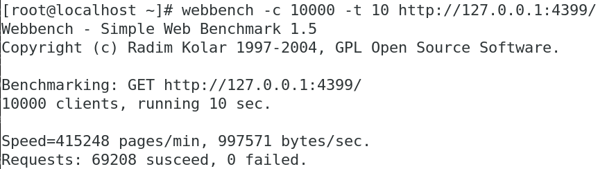

# nodejs风格的c++ 服务器
> linux c++服务器，由于c++语法本身繁琐，大多数的cpp服务器都不能像node服务器一样能快速上手，因此，打算做一个仿`nodejs`的express框架风格的c++服务器，懂一点点c++就能快速上手部署。

做这个项目给最近学的知识作一个总结贯通吧。
## 项目特点
* `nodejs`风格，用起来语法简单
* 支持Websocket，服务器推送
* 支持get,支持get参数解析
* 支持静态html页面展示，页面放在www文件夹
* 支持post，支持`application/x-www-form-urlencoded`，`text/plain`，`application/json`的Content-Type内容解析
* 引入`rapidjson`支持json解析，如果只有一层json会默认解析成map
* 三种客户端：socket回射,http,websocket
* 半同步/半异步并发模型（Reactor模型），利用epoll,ET边缘触发
* 支持多线程，eventfd唤醒子线程
* 利用小根堆非活跃连接超时断开，http为3分钟，websocket为10分钟
* 使用状态机解析http头与websocket帧
* C++11特性，bind，shared_ptr,std::function，auto等应用

## 快速上手
```cxx
int main()
{
    Server app;
    app.get("/", [](Req &req, Res &res){
        res.send("hello world");
    });
    app.listen(8080);
    app.run();
}
```
够简单了吧，不用看文档都知道是什么意思了
## 更多功能
### websocket
```cxx
app.ws("/websocket", [](SP_WSPool io){
    io->on_connect([](SP_WSClient socket){ // 收到客户连接事件
        socket->on_get([](string text, SP_WSClient _this) { //客户收到数据事件
            _this->emit(text); //简单的回射
        });
    });
});
```
### post
```cxx
app.post("/", [](Req &req, Res &res){
    res.send(req.data["name"]);
});
```
详细用法参考main.cpp
## 安装
需要先将将[rapidjson库](https://github.com/Tencent/rapidjson)的`include/rapidjson`文件夹放在根目录
```shell
mkdir build && cd build && cmake .. && make
```
## 目录结构
```shell
.
├── build #cmake生成路径
├── CMakeLists.txt 
├── main.cpp
├── rapidjson #json解析库
├── Readme.md
├── src
│   ├── Client #客户处理
│   ├── mutex.h
│   ├── Pack.cpp
│   ├── Pack.h
│   ├── Server.cpp
│   ├── Server.h
│   ├── Thread.cpp
│   ├── Thread.h
│   ├── ThreadPool.cpp
│   ├── ThreadPool.h
│   ├── Timer
│   ├── util.cpp
│   └── util.h
└── www #静态文件
    └── index.html
```
# 压力测试

使用webbench，支持上万的并发。



# TODO

- [x] 添加json支持
- [X] 添加websocket支持
- [ ] 添加日志系统

